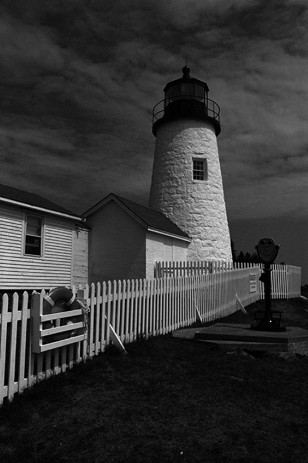
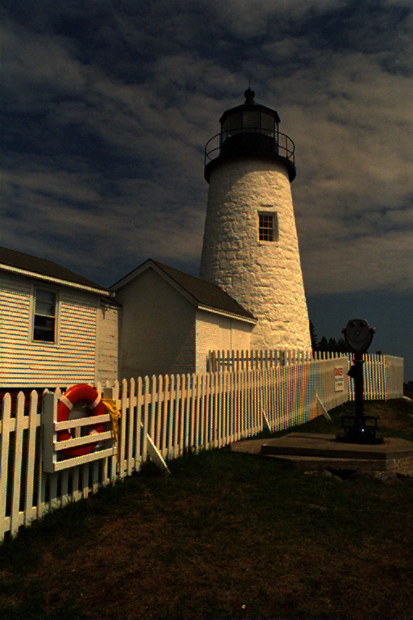
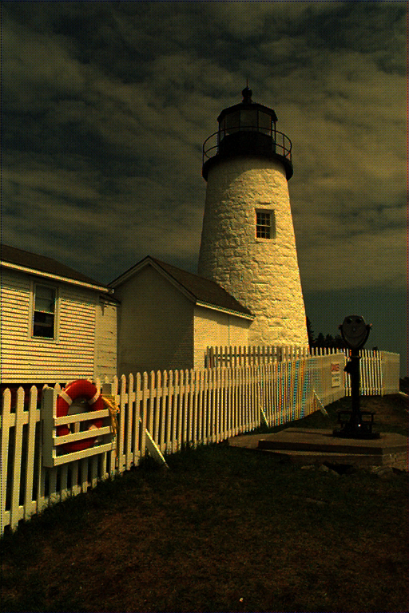
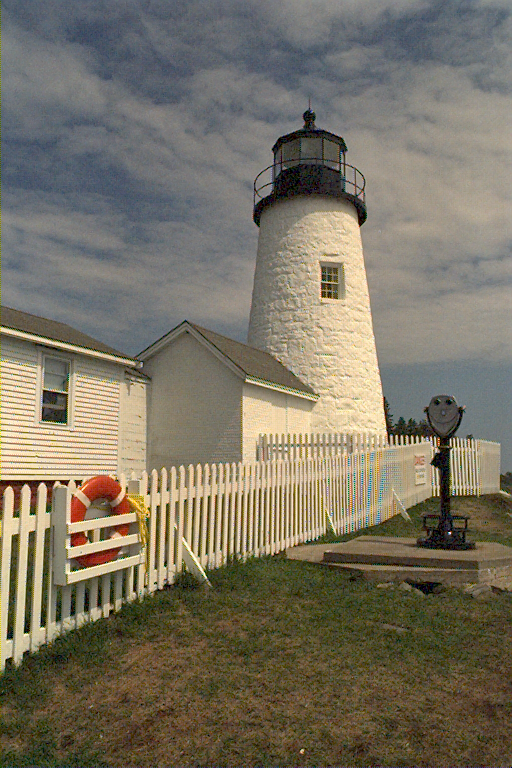
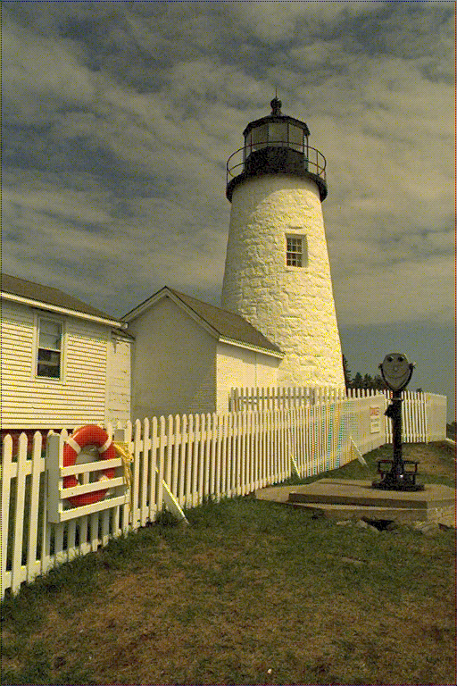

## Basic image processing (demosaicing + medium filter + gamma correction)
*DISCLAIMER*: It's student project. DON'T treat it as reference of good code or how to 'make things done' in any way, please!

You can use both python and python3.
Scroll down to see effects.

## Dependencies
- PIL
- numpy

## Usage
```
usage: pipe.py [-h] [--gamma [GAMMA]] [--edge_directed]
               [--filter_density [FILTER_DENSITY]] [--channels_reversed]
               [--print_everything]
               src

Simple image processing pipe (demosaicing + median filter + gamma correction

positional arguments:
  src                   A required src of img to process

optional arguments:
  -h, --help            show this help message and exit
  --gamma [GAMMA]       Gamma correction coefficent
  --edge_directed       An edge directed switch
  --filter_density [FILTER_DENSITY]
                        Median filter density (1 - 3x3 filter perfmored at
                        every step (row++ col ++) 3 - performed at every
                        3-step (row+=3 col+=3)
  --channels_reversed   Pass false if mosaic is in form: B G B G G R G R
  --print_everything    An edge directed switch

```

## Examples
(python3 is slight faster)
```
$ python3 pipe.py lighthouse_RAW.png  --gamma 2.2 --filter_density=1 --print_everything --edge_directed
$ python3 pipe.py signs-small.png  --gamma 1.9 --print_everything --edge_directed --channels_reversed
```

### Base picture

### Demosaicing (naive)

### Demosaicing (edge_directed)

### Demosaicing (edge directed) + gamma correction

### Demosaicing (edge directed) + median filter (density: 1) + gamma correction (gamma: 2.2)


